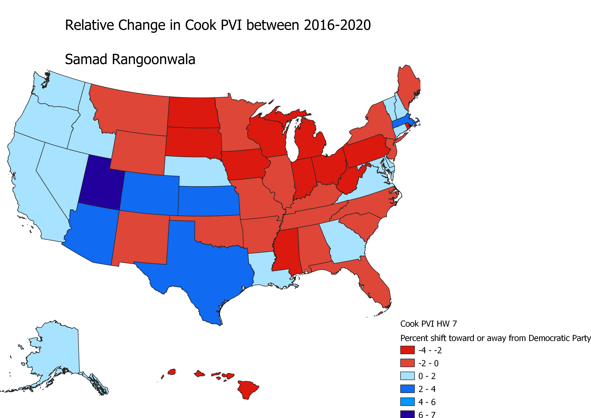

# HW 7
 <!DOCTYPE html>
<html lang="en">
<head>
    <meta charset="UTF-8">
    <meta name="viewport" content="width=device-width, initial-scale=1.0">
    
</head>
<body>
    

<h2>Samad Rangoonwala</h2>

<h3> This map shows the change in Cook Partisan Voting Index values (PVI) by state from 2016 to 2020. Cook PVI looks at the popular vote in the last 2 presidential election cycles and tells us how each state voted compared to the national average. PVI data is dated by the midterm after the second election that is used so data based on 2012 and 2016 is in the 2018 data set and 2016-2020 is in the 2022 dataset, this map uses 2018-2022 to show the change between 2016-2020. A state with a PVI of D+2 voted 2% more democractic then the nation as a whole over the last 2 presidential elections. So a state with a D+2 value would be expected to vote 52-48 for the democrat in an election in which both parties get 50% of the vote. PVI values give a good look into how each state votes compared to the rest of the country. This map shows the change in PVI over 2016-2020 as a measure of how much more or less democratic each state got. For example Utah, while a reliable red state with a 2022 PVI of R+13, however its represented as a deep blue state because the 2018 value is R+7 meaning Utah got 7% more democratic then the nation as a whole between 2016-2020. The map shwos us some interesting changes, 20 states shifted toward the GOP notably the rust belt and parts of the North East. Its important to note here, states such as PA and MI are deep red despite flipping from Trump to Biden in 2020. That's because while those states did vote more democract in 2020 then they did in 2016 their shift was less then the country as a whole. The map also shows that while demographic changes continue to make states across the south like Georgia, Texas and Arizona more competitive, those same changes haven't been enough to pull states like North Carolina and Florida closer.    </h3>
<!-- Your map goes here -->
<a href="HW7.png">
    

 https://github.com/Samadrangoonwala/HW-7/blob/main/CookPVIHW7.csv
 https://github.com/Samadrangoonwala/HW-7/blob/main/HW7Vector.geojson
    
<a href="CookPVIHW7.csv" alt=CookPVIHW7>

<a href="HW7Vector.geojson" alt=HW7Vector>

<h3>Data was found at, https://www.cookpolitical.com/cook-pvi/2022-partisan-voting-index/state-map-and-list 
 and https://www.cookpolitical.com/state-pvis 
 Data was then combined and cleaned, used to find the difference for each state and then joined with Vector.</h3>

    
